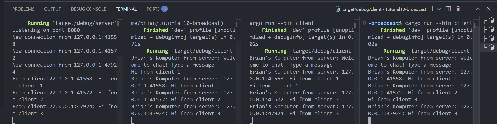

# Reflection 

## 2.1 Original code of broadcast chat


To run the server, we use `cargo run --bin server`, and to start the client, we use `cargo run --bin client`. This setup simulates a websocket communication between the server and clients: whenever a client sends a message, the server broadcasts it to all active clients.

## 2.2 Modifying port 

In `server.rs`

```rust 
let listener = TcpListener::bind("127.0.0.1:8080").await?;
```

We can easily change the ports used for communication between the client and server by modifying the `server::bind` function on the server side and the `client::connect` function on the client side.

# 2.3: Small changes, add IP and Port


Changing the port does not affect the websocket protocol itself and the protocol continues to function correctly. The only difference is that the server and client now communicate over a different network port. Everything else remains the same.