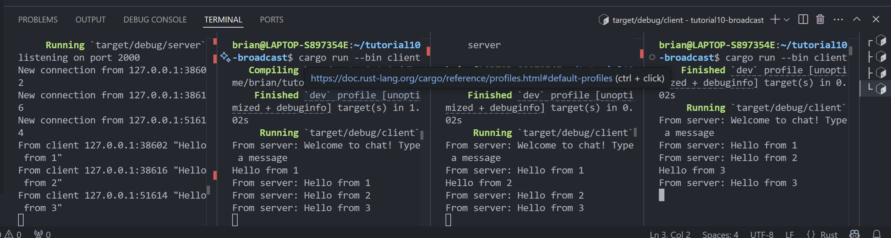

# Reflection 

## 2.1 Original code of broadcast chat

To run the server, we use `cargo run --bin server`, and to start the client, we use `cargo run --bin client`. This setup simulates a websocket communication between the server and clients: whenever a client sends a message, the server broadcasts it to all active clients.